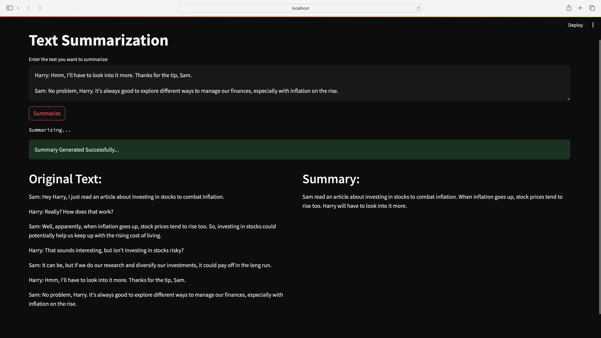
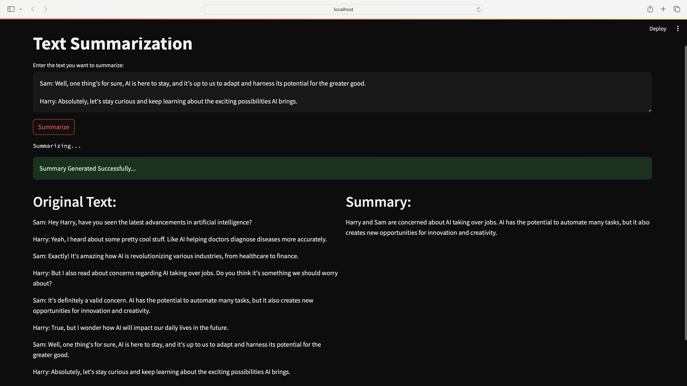
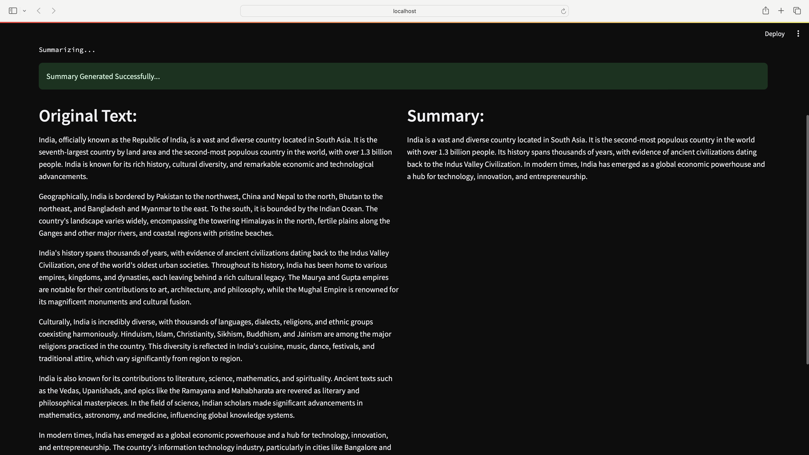

# 🧠 Dialogue-Based Text Summarization using BART

This project demonstrates how to fine-tune the pretrained language model facebook/bart-large-cnn on the SAMSum dialogue dataset to generate concise, high-quality summaries from conversational data. The goal is to transform unstructured dialogue into meaningful summaries, preserving context while reducing length.

Such summarizers are valuable for various industries—e.g., summarizing customer support chats, chatbot interactions, and business meetings—by saving time, improving understanding, and aiding issue resolution. 

# Screenshots of Sample Outputs:

# Project Structure:

1. Data ingestion (SAMSum dataset)
2. Fine-tuning facebook/bart-large-cnn model 
3. Uploading to Hugging Face Model Hub
4. loading the fintuned model on local machine using Huggingface API
5. Deploying a Streamlit web app for interaction

# Data Ingestion: 
Samsum dataset contains ~16,370 dialogues with ground-truth summaries..
Data can be downloaded from kaggle https://www.kaggle.com/datasets/nileshmalode1/samsum-dataset-text-summarization
or from Huggingface site or using tne command "samsum=load_dataset('samsum')" using load_datset function.

# Model Finetuning 

1. Base Model:  [facebook/bart-large-cnn](https://huggingface.co/facebook/bart-large-cnn). Originally trained on cnn dataset containing news articles and their summaries.

2. Fine-Tuned Model: finetuned-facebook-bart-samsum  [codebasics/finetunedN-facebook-bart-samsum](https://huggingface.co/codebasics/finetunedN-facebook-bart-samsum/commit/2e5c2086edc535c995ed6b8666daa0e718a83b82). adapted to conversational data via transfer learning on SAMSum.

3. Training Setup:

  1 epoch (memory constraint)

  Optimizer: AdamW

  Approx. training loss: 1.428

6. Performance metrices of base model and fintuned model
   Base Model:

                  Rouge-1: 0.0923
                  Rouge-2: 0.0178
                  Rouge-L: 0.0771
                  Rouge-Lsum: 0.0754
   
  Fine-tuned Model:

                  Rouge-1: 0.1491
                  Rouge-2: 0.0619
                  Rouge-L: 0.1152
                  Rouge-Lsum: 0.1152

The fine-tuned model consistently outperforms the base model across all ROUGE metrics, showing enhanced performance in summarizing informal dialogue.

6. Future improvement: Training for multiple epochs could further increase accuracy and fluency.

# Streamlit application:
To improve usability, the model is deployed in a web interface built using Streamlit. Users can enter freeform dialogue or plain text and get instant summaries using the fine-tuned BART model hosted on Hugging Face.

# Steps to run the streamlit application:

1. clone the repository: git clone https://github.com/ravina029/TextSummarizer-finetuned-bart-samsum/tree/main
cd TextSummarizer-finetuned-bart-samsum

2. Create a virtual environment (recommended) and activate it.
      python -m venv venv
      source venv/bin/activate  # or venv\Scripts\activate on Windows
      pip install -r requirements.txt

2. Install the required depencies.

3. Create a file named app.py and paste the code in the file summaryfinetuned.py.

4. Create a file named .env in the same directory as summaryfinetuned.py, 
   Add the line HUGGINGFACEHUB_API_TOKEN=YOUR_API_TOKEN
   ,replace YOUR_API_TOKEN with your Hugging Face Hub API token. (never share your API token)

5. Run the application from your terminal:
   streamlit run app.py

6. A Streamlit web app will open in your browser. Enter text in "Enter the text you want to summarize:" field and click "Summarize".

7. The application will display the summarized text alongside the original input.

# 🧩 Key Contributions
1. Fine-tuned a powerful LLM for a domain-specific summarization task.

2. Improved model performance on dialogue data.

3. Built a working deployment pipeline using Streamlit and Hugging Face Hub.

# 🔬 Research Extensions

If developed further, this project could be extended into a full research experiment:

Compare with flan-t5, pegasus, and longformer

Conduct ablation on max token length, prompt formatting, or pretraining dataset

Evaluate generalization on unseen dialogue datasets (e.g., MultiWOZ, DSTC)

Integrate Reinforcement Learning with ROUGE reward

# Points of improvement: 
Quality of summary can be improved by training the model for more than 1 epoch.